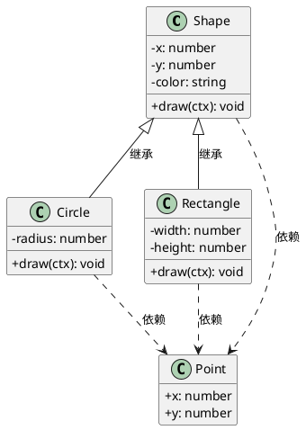

# 2026-04-01 日记

## UML 课堂任务：Shape 继承与关联类图 + Canvas 画图工具

### 作业文件
- 路径：`~/Documents/trae_projects/UML作业/shape-inheritance/`

### 完成内容
1. **PlantUML 类图 × 2 版本**
   - `Shape_Inheritance_Class_Diagram.png` — 简洁版，推荐交作业用
   - `Shape Inheritance UML.png` — 详细注释版
   - 关系：Circle/Rectangle 继承 Shape（实线），都依赖 Point（虚线）

2. **HTML5 Canvas 画图工具** `index.html`
   - 修复了页面滚动问题（flex 布局 + overflow:hidden）
   - 修复了画图定位逻辑：
     - **点击**：在点击位置生成固定大小图形
     - **拖拽**：起点→终点，图形中心在两点中点（标准拖拽逻辑）

3. **StarUML .mdj 放弃**
   - MDJ JSON 结构不兼容 StarUML 版本，视图排版失败
   - 直接用 PlantUML PNG 代替，效果更好

### 经验沉淀

**PlantUML 类图语法（简洁版，无报错的写法）：**

- 不要在类定义后面直接加 `note right of Shape::method`（1.2026.2 有时会报错）
- 关系标签用 `: 标签 (英文)` 而非纯中文，避免编码问题

**Canvas 拖拽绘图定位算法（已验证正确）：**
```
起点 (x1, y1)，终点 (x2, y2)
- 图形中心 = ((x1+x2)/2, (y1+y2)/2)
- 圆形半径 = distance(起点, 终点) / 2
- 矩形宽高 = |x2-x1|, |y2-y1|
```
