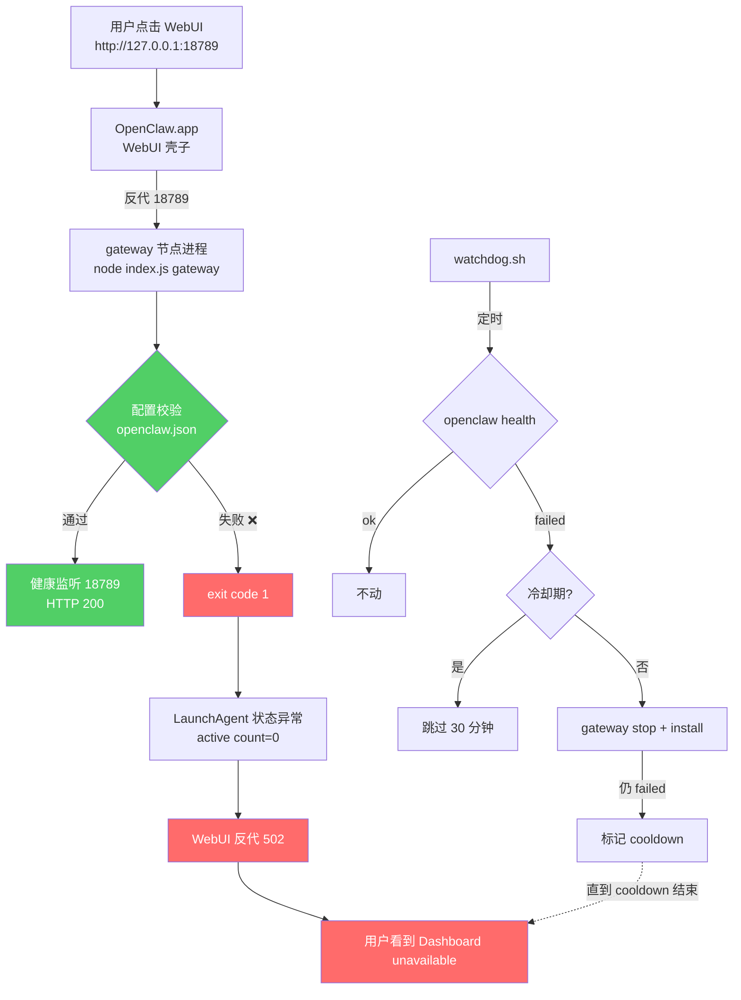

# 📝 学习笔记: openclaw 网关 WebUI 502 急救

> 创建时间: 2026-06-27
> 对应任务: 重启 openclaw 网关后 WebUI 一直 "Dashboard unavailable / Could not connect"，恢复失败

## 1. 通俗理解 (The "Why")

OpenClaw 的"控制面板打不开"看起来是 WebUI 死机，其实根因是**网关的配置文件不合规**。新版 openclaw 给 `active-memory` 插件三个字段加了**上限校验**（`recentUserChars ≤ 1000`、`recentAssistantChars ≤ 1000`、`cacheTtlMs ≤ 120000`），旧配置里写大了（1800/1400/300000），于是网关**一启动就立刻 exit 1**。

- **LaunchAgent**（macOS launchd）一直试图拉起网关 → 一直失败 → `state = spawn scheduled, active count = 0`
- **WebUI 壳子**（OpenClaw.app）一直活着 → 反代到 18789 拿到 502 → 用户看到 "Dashboard unavailable"
- **watchdog** 的 `gateway stop && install` 修不了 config bug → 30 分钟冷却期里啥也不干 → 卡死

## 2. 核心概念 (Key Concepts)

- **LaunchAgent (launchd)**：macOS 的服务管理器。把脚本/二进制注册成开机自启 + 挂了自动重启。类比：餐厅的"自动开关门机 + 排班系统"。
- **KeepAlive=true**：launchd 的"班次一直有人"开关。如果进程退出，会立刻被拉起来。**但是**如果进程**每次都秒退（exit 1）**，launchd 也会一直拉，只是拉不起来而已。
- **launchctl bootout / bootstrap / kickstart**：分别是"踢出域"、"重新注册"、"立刻拉起"。类比：把人从排班表里删掉 → 重新填表 → 按铃叫人。
- **WebUI 反代 502**：浏览器看到的"WebUI"和真正的"gateway"是**两个独立进程**。WebUI（OpenClaw.app）只是把 HTTP 请求转给 gateway，gateway 不在时它就回 502。所以 **HTTP 502 ≠ WebUI 死了**，而是 **WebUI 找不到后端**。
- **watchdog 冷却期 (cooldown)**：防止频繁重启的安全阀。**但如果重启也失败**，冷却期反而会变成"死锁期"——bug 没修就不会自愈。
- **active-memory 插件**：openclaw 内置的记忆压缩/摘要模块，有**严格配置上限**（防止 OOM / prompt 爆炸）。升级新版后这些上限会被强制执行。

## 3. 架构图解 (Visual Map)



## 4. 复现与验证

```bash
bash -x /Users/Ymir/.openclaw/service-env/ai.openclaw.gateway-env-wrapper.sh \
  /Users/Ymir/.openclaw/service-env/ai.openclaw.gateway.env \
  /Users/Ymir/.openclaw/tools/node-v22.22.0/bin/node \
  /Users/Ymir/.openclaw/lib/node_modules/openclaw/dist/index.js \
  gateway --port 18789

launchctl kickstart -k gui/$(id -u)/ai.openclaw.gateway
sleep 8
curl --noproxy '*' -I http://127.0.0.1:18789/
openclaw health
```

## 5. 经验教训

1. WebUI 打不开不等于 WebUI 自己挂了，先区分前端壳子和 gateway。
2. `last exit code = 1` 比 "怎么重启" 更重要。
3. watchdog 只看 IPC health 不够，最好同时看 HTTP 200。
4. 冷却期如果没有告警，会把配置错误变成长时间死锁。
5. 改配置前一定先备份。
